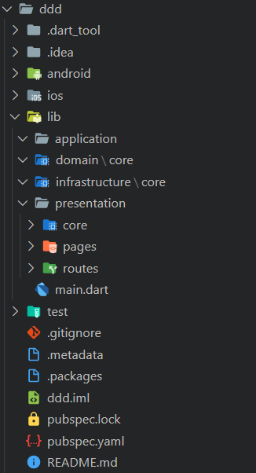

# Create a flutter project with DDD folders

## Example use

* Need to add permission to execute: chmod +x script.sh

* It's required to pass project name

* 	 ***./script.sh ddd***

## Additional Packages  installed

* meta
* equatable
* flutter_bloc

## Screenshot.
